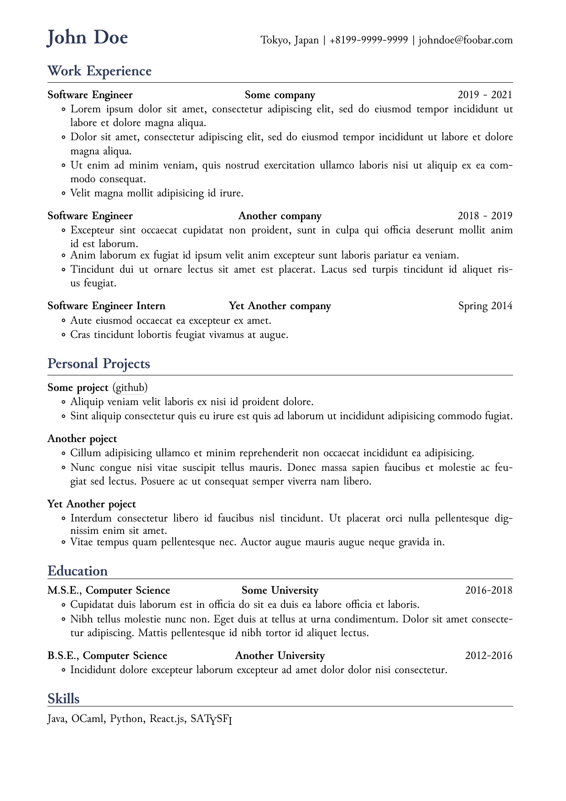

# resume-satyh

[](./LICENSE)

A [SATySFi](https://github.com/gfngfn/SATySFi) class for writing resume / cv. Layout is inspired by the example in [this article](https://www.careercup.com/resume).

## Example



## Dependencies

- [SATySFi](https://github.com/gfngfn/SATySFi)
- [satyrographos](https://github.com/na4zagin3/satyrographos)
- [satysfi-enumitem](https://github.com/monaqa/satysfi-enumitem)

## How to use

```shell
$ opam install satysfi-enumitem
$ satyrographos install
$ satysfi demo.saty
```
